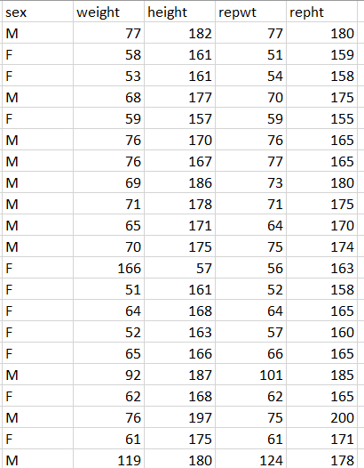
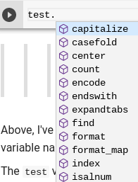
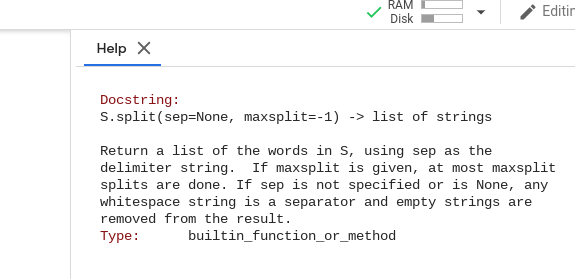

_[Link to Notebook Version of Lab](https://github.com/organisciak/Scripting-Course/blob/master/labs/02-database-intropython-lab.ipynb)_


# Lab Part 1: SQLite

For this portion of the lab, we won't use Python. Instead, we'll work directly with SQLite.

There are two ways to work with SQLite. You can either

**Option 1: In a Jupyter Notebook**

1. In a code cell of a notebook, run the following code:


```python
!pip install ipython-sql
%load_ext sql
%sql sqlite://
```

That installs a special command to connect to SQLite, loads it, and connects to a temporary database.

Now, if you have `%%sql` at the start of a code cell, it will run SQL in your connected database.

_Now that it's installed, you won't have to run the first line (install) again, just load and connect._

*Tip*: If you don't want your DB to be temporary, you can give it a name when you connect, like this: `%sql sqlite:///name.db`.

**Option 2: Command Line**

1. Open a command line.
    - *Windows*: Open ‘Command Prompt’ from the Start Menu and type: `activate`.
    - *Mac OS/Linux*: Open ‘Terminal’ from Applications and type `source activate`.
2. Type `sqlite3` and press enter.


## Create a Table, Insert Data, and Select in SQLite

Here is a small dataset of British cotton workers in 1886, and their average wage:

| worker | num_workers |	wage |
|------------------------------|
|Big piecer|	5902|	233.59|
|Engineman|	909|	388.47|
|Foreman	|2883|	466.54|
|Grinders|	1983|	399.9|
|Labourer|	208|	269.73|
|Mechanic|	669|	440.82|
|Others	|2966|	311.64|
|Sizer	|597|	469.62|
|Spinner	|6951|	408.97|
|Twister|	865|	357.2|

Let's consider how to put this into a database. First, you need to CREATE TABLE, then INSERT records.


```python
%%sql
CREATE TABLE worker_wages (role, num_workers, wage);
```

    Done.


    []


If running on the command line, don't include the `%%sql` part.

Now, insert the data:


```python
%%sql
INSERT INTO worker_wages VALUES
    ('Big piecer', 5902, 233.59),
    ('Engineman', 909, 388.47),
    ('Foreman', 2883, 466.54),
    ('Grinders', 1983, 399.9),
    ('Labourer', 208, 269.73),
    ('Mechanic', 669, 440.82),
    ('Others', 2966, 311.64),
    ('Sizer', 597, 469.62),
    ('Spinner', 6951, 408.97),
    ('Twister', 865, 357.2);
```

    10 rows affected.


    []


Hopefully it's in: let's check:


```python
%%sql
SELECT * FROM worker_wages;
```

    Done.


<table>
    <tr>
        <th>role</th>
        <th>num_workers</th>
        <th>wage</th>
    </tr>
    <tr>
        <td>Big piecer</td>
        <td>5902</td>
        <td>233.59</td>
    </tr>
    <tr>
        <td>Engineman</td>
        <td>909</td>
        <td>388.47</td>
    </tr>
    <tr>
        <td>Foreman</td>
        <td>2883</td>
        <td>466.54</td>
    </tr>
    <tr>
        <td>Grinders</td>
        <td>1983</td>
        <td>399.9</td>
    </tr>
    <tr>
        <td>Labourer</td>
        <td>208</td>
        <td>269.73</td>
    </tr>
    <tr>
        <td>Mechanic</td>
        <td>669</td>
        <td>440.82</td>
    </tr>
    <tr>
        <td>Others</td>
        <td>2966</td>
        <td>311.64</td>
    </tr>
    <tr>
        <td>Sizer</td>
        <td>597</td>
        <td>469.62</td>
    </tr>
    <tr>
        <td>Spinner</td>
        <td>6951</td>
        <td>408.97</td>
    </tr>
    <tr>
        <td>Twister</td>
        <td>865</td>
        <td>357.2</td>
    </tr>
</table>


It's in! Let's look for wages under 350:


```python
%%sql
SELECT * FROM worker_wages WHERE wage < 350;
```

    Done.


<table>
    <tr>
        <th>role</th>
        <th>num_workers</th>
        <th>wage</th>
    </tr>
    <tr>
        <td>Big piecer</td>
        <td>5902</td>
        <td>233.59</td>
    </tr>
    <tr>
        <td>Labourer</td>
        <td>208</td>
        <td>269.73</td>
    </tr>
    <tr>
        <td>Others</td>
        <td>2966</td>
        <td>311.64</td>
    </tr>
</table>


You can use `AND` to combine `WHERE` clauses. E.g. Workers that number over 1000, which make over 300£. 


```python
%%sql
SELECT * FROM worker_wages WHERE wage > 300 AND num_workers > 1000;
```

    Done.


<table>
    <tr>
        <th>role</th>
        <th>num_workers</th>
        <th>wage</th>
    </tr>
    <tr>
        <td>Foreman</td>
        <td>2883</td>
        <td>466.54</td>
    </tr>
    <tr>
        <td>Grinders</td>
        <td>1983</td>
        <td>399.9</td>
    </tr>
    <tr>
        <td>Others</td>
        <td>2966</td>
        <td>311.64</td>
    </tr>
    <tr>
        <td>Spinner</td>
        <td>6951</td>
        <td>408.97</td>
    </tr>
</table>


One final clause: `DROP TABLE`. If you mess something up, you can always drop the table and start again. Be careful doing this in a real, important database, there is no _UNDO_!


```python
%%sql
DROP TABLE worker_wages;
```

    Done.


    []


## Exercises

**Q**: Write the SQL to add these two rows to the `worker_wages` table:
        
| worker | num_workers |	wage |
|------------------------------|
|Drawer |	375|	328.98|
|Warehouseman|	1586|	308.73|

**Q**: What's wrong with this SQL?
```sql
    INSERT INTO worker_wages VALUES (Weaver, 8577, 273.97);
```

**Q**: Consider the following dataset, of people's heights and weights, as well as their reported heights and weights:



- What's the SQL to create the table for this dataset? Include appropriate data types for the columns.
- How would you select:
    - The men that say they're taller than 100cm?
    - The people that say they're taller than they are?
    - The women that overestimate their weight and underestimate their height?
    
Tips:
 - Think about what is being compared in the where clause. How many comparisons are needed, connected by an 'AND'? What operators are needed to make those comparisons? What value or variable goes on each side of the operator.
 - If you want to test it, you add a few dummy rows to test, or import the full dataset. Here's some code to copy and paste - _don't worry about understanding it now_:
 
In a notebook:
 ```
 from sqlalchemy import create_engine
import pandas as pd
data = pd.read_csv('https://vincentarelbundock.github.io/Rdatasets/csv/car/Davis.csv')
engine = create_engine('sqlite:///week2.db')
data.to_sql('heights', engine, index=False)
%sql sqlite:///week2.db
```

Command line:
First, download the [dataset](https://vincentarelbundock.github.io/Rdatasets/csv/car/Davis.csv) to the same folder that your connection is in, then try:

```
.mode csv
.import davis.csv heights
.mode list
```


```python
%%sql
SELECT * FROM heights
WHERE sex == 'F' 
    AND weight > repwt
    AND height < repht
```

    Done.


<table>
    <tr>
        <th>index</th>
        <th>Unnamed: 0</th>
        <th>sex</th>
        <th>weight</th>
        <th>height</th>
        <th>repwt</th>
        <th>repht</th>
    </tr>
    <tr>
        <td>11</td>
        <td>12</td>
        <td>F</td>
        <td>166</td>
        <td>57</td>
        <td>56.0</td>
        <td>163.0</td>
    </tr>
    <tr>
        <td>34</td>
        <td>35</td>
        <td>F</td>
        <td>68</td>
        <td>169</td>
        <td>63.0</td>
        <td>170.0</td>
    </tr>
    <tr>
        <td>82</td>
        <td>83</td>
        <td>F</td>
        <td>53</td>
        <td>169</td>
        <td>52.0</td>
        <td>175.0</td>
    </tr>
    <tr>
        <td>147</td>
        <td>148</td>
        <td>F</td>
        <td>59</td>
        <td>157</td>
        <td>55.0</td>
        <td>158.0</td>
    </tr>
    <tr>
        <td>152</td>
        <td>153</td>
        <td>F</td>
        <td>47</td>
        <td>150</td>
        <td>45.0</td>
        <td>152.0</td>
    </tr>
</table>


*Q*: Convert the following SQL to plain text:

```sql
SELECT author,book FROM books
    WHERE release_year > 2000
        AND sales > 100000
        AND author != 'J.K. Rowling'
```

# Part 2: More Python

Today, we're working on more Python basics, as we build toward more our SciPy stack of data science tools.

## Loops

Recall the `list` type, created like this:


```python
fruits = ['apple', 'banana', 'strawberry', 'mango']
```

If we wanted to run through each value of the list, we can use a `for` loop.

```python
for value in last:
    do_something
```

For example:


```python
for fruit in fruits:
    print(fruit)
```

    apple
    banana
    strawberry
    mango


A number of things happened here. Note:

- The `for` loop runs four times: once for each value of the list.
- At the start of each time the loop is run, a new value of `fruits` is assigned to the temporary variable `fruit`. Essentially, the code above is running the following commands:

```python
fruit = 'apple'
print(fruit)
fruit = 'banana'
print(fruit)
fruit = 'strawberry'
print(fruit)
fruit = 'mango'
print(fruit)
```

- `print(...)` will print any variable to the screen. The curly braces are necessary.
- We use indentation to show that `print(fruit)` is part of the `for` loop. Python will run through all the indented code before moving on. See:


```python
for fruit in fruits:
    print(fruit)
print('this prints after the loop')
```

    apple
    banana
    strawberry
    mango
    this prints after the loop


- There can be multiple lines inside the loop:


```python
for word in ['hello', 'world']:
    x = word.capitalize()
    print(x)
```

    Hello
    World


## New Data Type: boolean

The boolean type is simply a `True` or `False` value. Like integers and floating point numbers, you don't need to put quotation marks around `True` or `False`.


```python
newtype = True
newtype
```


    True


```python
newtype = False
newtype
```


    False


## Comparisons

There are a set of symbols that are used to compare two values. Usually, these return a boolean value: if the comparison statement is `True` or `False`. These are _logical operators_.

The most basic operator is for equality, the `==` sign. For example:


```python
1 == 1
```


    True


```python
'hello' == 'hello'
```


    True


```python
'hello' == 'world'
```


    False


```python
[1, 2, 3] == [1, 2, 3]
```


    True


Other logical operators include:

- `!=` - Not equal
- `<` - Less than
- `>` - Greater than
- `<=` - Less than or equal to
- `>-` - Greater than or qual to

Each of these is used the same as the equality operator. 

*Q*: Write a loop that prints the numbers from 1 to 5.

*Q*: Set a variable `x` to 0, then write a loop to add the following numbers to it: 1,1,2,3,5,8,13,21.

*Q*: True or False:

- "hello"+"world" == "hello world"
- 2 != 3
- 'a' < 'b'

*Q*: In Python, are `1` (an integer) and `'1'` (a string) equivalent?
 - *Q*: What about `1` and `1.0`?
 
*Q*: Functionally, what is the difference between the following two code blocks?

_Code A_
```
s = 'hello world'
s == 'hello moon'
```

_Code B_
```
s = 'hello world'
s = 'hello moon'
```

*Q*: True or False: A list cannot have another list inside it.

## Jupyter

Hopefully by this week, you are growing more comfortable with starting Jupyter Notebooks and adding/editing cells. Remember that the keyboard shortcuts are invaluable: running a cell with `Ctrl+Enter`, or adding a new cell below with `B` (in command mode).

Two tricks to try this week: autocompletion and retrieving documentation.

**Autocomplete**

If you start typing a known object or function into Jupyter, you can press `TAB` to finish it. This is especially useful for seeing what functions are available.


```python
test = "this is a string"
```

Above, I've set a string to `test`. If I type `te` then press tab, it will complete the word. This is especially useful for long variable names that you don't want to keep typing. Note that it only completed because there no other options: in that case, there's a scrollable list of candidates for what you might be looking for.

The `test` variable is a string. To see what options there are for acting upon a string, try typing `test.` then press TAB. Magic!



** Documentation reference **

If you want to look up information about a function, you can precede the code running that function with a `?`. For example, if I want to learn how I would use `split()` on `test`, I can type:


```python
?test.split()
```

This will open a panel that looks like this in Jupyter:



The documentation is only as good as what the library is documented, so some libraries might be more or less detailed in this feature.

- *Q*: What does `test.isalpha()` do? Paste the documentation string.
- *Q*: Strings have access to a function (whose name starts with a `ce`) that will let you change "HEADING" to "====HEADING====" (that is, padding with `=` to make the string 15 characters wide). What's the code to do that? (tip: this is an auto-fill question!)

## Summary

- SQLite
    - Connecting to a simple database, via notebook (without Python) or command line
- SQL
    - `CREATE TABLE`
    - `DROP TABLE`
    - `SELECT`
    - `INSERT`
    - `WHERE` clause
- Python
    - Logical Operators
        - `==`, `!=`, `<`, `<=`, `>`, `>=`
    - `for` loops on arrays
    - `print()`
    - Tab indentation
    - boolean datatype: `True`, `False`
- Jupyter
    - Auto-complete
    - Documentation lookup
