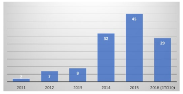
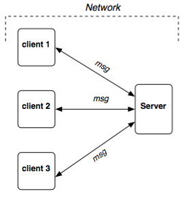

_[Link to Slides](http://www.porganized.com/Scripting-Course/slides/02-databases.html)_


# Week 2: Relational Databases and Python

## Today

- More on relational databases
- Fundamentals of SQL
    - Hands-on
- More Python concepts

### Announcements?

- RMIS Research Conference: Friday
- Python Group

## Review

- relational database
- SQL
- no-SQL
- structured data
- semi-structured data

## Review Lab Skills

- What's a 'notebook'? 
- Why did we install _Anaconda_?
- Python
   - What are lists?
   - How do strings, integers, and floats differ?
       - What happens when you add them?
   - How do you set a variable?

## Librarianship

### What is Data?

‘any  information  that  can  be  stored  in  digital  form,  including  text,  numbers,  images,  video  or  movies,  audio,  software,  algorithms,  equations,  animations,  models,  simulations,  etc.’ 

National Science Board. (2005). Long-Lived  Digital  Data Collections: Enabling Research and  Education in the 21st Century. Arlington, VA: National Science Foundation.



**Library articles discussing 'big data'**

Zhan, M., & Widén, G. (2017). Understanding big data in librarianship. Journal of Librarianship and Information Science, 0961000617742451. https://doi.org/10.1177/0961000617742451

### What is 'Big Data' in Librarianship?

- Volume: Lots of data!
- Velocity: Working with data that comes in quick.
- Variety: Working with a wide variety of data and data types
- Veracity: Ensuring the reliability and integrity of data

Fosso Wamba, S., Akter, S., Edwards, A., Chopin, G., & Gnanzou, D. (2015). How ‘big data’ can make big impact: Findings from a systematic review and a longitudinal case study. International Journal of Production Economics, 165, 234–246. https://doi.org/10.1016/j.ijpe.2014.12.031

From a review of 35 library articles (Zhan & Widén 2017):
 - 29 mention volume, 12 mention velocity, 12 mention variety, 12 mention veracity

## Data Literacy

> the ability to understand, use and manage data.

Koltay, T. (2017). Data literacy for researchers and data librarians. Journal of Librarianship and Information Science, 49(1), 3–14. https://doi.org/10.1177/0961000615616450

> All librarians 
are interested in information literacy; archivists and data 
librarians are interested in data literacy.

Schield, M. (2004). Information Literacy, Statistical Literacy and Data Literacy.

Such as... 
> [Information Science] students need to understand a wide variety 
of tools for accessing, converting and manipulating data.  
These may need to understand structured query language 
(SQL), relational databases (e.g. MS Access), data 
manipulation techniques, statistical software (e.g., SPSS, 
STATA, Minitab and MS Excel) and data presentation 
software (e.g., MS Excel and MS PowerPoint).  

### Core competencies: What should a data literate librarian know?

- Curation: active management of research data
- Wrangling: ability to process, clean, normalize, and transform data
- Mix of practical skills and theory (Cox et al 2013, via Semeler et al 2017)
- Adaptable to new contexts and technical needs

Semeler et al (2017):
    
 - specific knowledge on data usage, e.g. data types, metadata standards, legal and regulatory details, preservation
 - knowledge of info tech, such as Python, SQL, Java, XML, design of databases, large data, NLP

> A  data  librarian  need  not  become  a  programmer,  but should  be  interested  in  learning  about  the  languages  and  
programming  logic  of  computers

#### [Digital Curation Librarian - at Wake Forest University](https://jobs.diglib.org/job/digital-curation-librarian-4/)

"Desired:

- Demonstrated skills with scripting languages and/or tools for data manipulation (e.g. OpenRefine, Python, XSLT, etc.)"

#### [Metadata Librarian - at University of Florida](https://jobs.diglib.org/job/metadata-librarian-7/)

"Required:

- Demonstrated interest in and experience with any of the following tools (or others like them) to create, extract, transform, analyze, and/or quality control metadata: XSLT, Microsoft Excel, MarcEdit, OpenRefine, *scripting languages*, regular expressions, *SQL*."

#### [Library Systems Supervisor - City of Aurora](https://joblist.ala.org/job/library-systems-supervisor/40162599/)

Minimum Qualifications
     
 - Master's Degree in Information Systems or Library science 
 
Our ideal candidate must possess:
     
 - Knowledge of troubleshooting database issues
 - Strong proficiency with SQL and its variation among popular databases
 - Knowledge of Basic Scripting and Web Management
 
 
(_posted 6 days ago!_)

#### [Digital Library Software Architect - at University of Colorado Boulder](https://jobs.diglib.org/job/digital-library-software-architect-2/)

"What we require:

- Demonstrated programming skills in a programming language such as Javascript, Java, Python, and REST or SOAP APIs.
- Experience with database management software (e.g. MySQL) and search/indexing software such as Apache Solr."


#### [Business Research Librarian - at Stanford](https://joblist.ala.org/job/business-research-librarian/39943022/)

"Desired qualifications – Knowledge of SQL, statistical software packages and programming languages, such as Python."

## Relational Databases

Let's consider the parts of relational databases by zooming out from the finest value.

### Field

A single piece of data.

e.g. One datum.
e.g. A single column of a single record.


### Record

A collection of related fields, represented as one row in the table.


_What does a record represent?_

### Table

A collection of records, following the same schema, or description of fields.


### Relational Database

A collection of tables all in the same domain.


### DBMS

A _Database Management System_ (DBMS, or more exactly RDBMS) is the set of software programs that run your databases.

- e.g. MySQL, SQLite, PostgresSQL, etc.

_What's the difference?_

- 'Database' is the organizational model for your content, the DBMS is how that model and content is actually managed by a system.
- DBMS is like _Word_, the database is your document.

### Structure of a relational database

- DBMS
  - ↳ Database
    - ↳ Table
      - ↳ Records or Rows

### Spreasheet as Database

As per [Launch School](https://launchschool.com/books/sql/read/introduction#spreadsheetdb):

Because relational databases are tabular, we can imagine a single table as akin to a spreadsheet.


When do you put something in a database? When in a table?

### Concurrency

- ability for multiple users to access the same record

### Client-Server architecture



Via [Launch School](https://launchschool.com/books/sql/read/interacting_with_postgresql)

## Intro to SQL

**SQL is intended to read naturally: even if you can't write SQL, you should be able to read it**

```sql
CREATE TABLE cats (breed);
```

**SQL is expressed in _statements_, constructed from _keywords_**

Statement:

```sql
CREATE TABLE cats (breed);
```

keywords: `CREATE TABLE`

**Keywords are capitalized - by convention, not by requirement**

This is preferred:
    
```sql
CREATE TABLE cats (breed);
```

...but this works just fine:
    
```sql
create table cats (breed);
```

**End statements with a semi-colon**

Won't work in most systems:

```sql
CREATE TABLE cats (breed)
```


```python
# Ignore this for now: putting data in for an example
!pip install ipython-sql
```


```python
# Ignore this for now: connecting to a transient, in-memory database
%load_ext sql
%sql sqlite://
```

### CREATE TABLE


```python
%%sql
CREATE TABLE cats (breed, affection);
```

What's going on here?

>"create a table named _cats_ with a text field, _breed_ and an integer field, _affection_"

What if I run `CREATE TABLE` again?


```python
%%sql
CREATE TABLE cats (breed, affection);
```

    (sqlite3.OperationalError) table cats already exists [SQL: 'CREATE TABLE cats (breed, affection);'] (Background on this error at: http://sqlalche.me/e/e3q8)


**Solution**: IF NOT EXISTS keyword


```python
%%sql
CREATE TABLE IF NOT EXISTS cats (breed, affection);
```

    Done.


    []


_This doesn't do anything if the table exists, but avoids an error._

(Better solution: don't try to create tables that exist!)

### DROP TABLE

To delete a table, try the following:


```python
%%sql
DROP TABLE cats;
```

    Done.


    []


Use carefully!

### Creating with data types


```python
%%sql
CREATE TABLE cats (breed TEXT, affection INTEGER);
```

    Done.


    []


_How is this different?_

### Some data types

- text
- int - integer (like `int` in Python)
- float - floating point number (like `float` in Python)
- boolean - True/False values

### `INSERT` keyword

Pairs with `INTO` and `VALUES()`


```python
%%sql
INSERT INTO cats VALUES 
          ('Norwegian Forest',2),
          ('Bengal',5),
          ('Maine Coon',3);
```

    3 rows affected.


    []


_In plain text, what's happening here?_

"Insert three records into the table `cats`, representing cat `breed` names and an `affection` score."

- As in Python, text is quoted, integers are not.

## `SELECT` keyword

Get the data!


```python
%%sql
SELECT breed from cats;
```

    Done.


<table>
    <tr>
        <th>breed</th>
    </tr>
    <tr>
        <td>Norwegian Forest</td>
    </tr>
    <tr>
        <td>Bengal</td>
    </tr>
    <tr>
        <td>Maine Coon</td>
    </tr>
</table>


In plain text:

> "SELECT the `breed` field of the `cats` table"

How might we ask for "both the breed and affection field?" 
How might we ask for "all fields"?

- Separate field names by commas
- Say 'all fields' with `*`


```python
%%sql
SELECT breed, affection from cats;
```

    Done.


<table>
    <tr>
        <th>breed</th>
        <th>affection</th>
    </tr>
    <tr>
        <td>Norwegian Forest</td>
        <td>2</td>
    </tr>
    <tr>
        <td>Bengal</td>
        <td>5</td>
    </tr>
    <tr>
        <td>Maine Coon</td>
        <td>3</td>
    </tr>
    <tr>
        <td>Norwegian Forest</td>
        <td>2</td>
    </tr>
    <tr>
        <td>Norwegian Forest</td>
        <td>test</td>
    </tr>
</table>


```python
%%sql
SELECT * from cats;
```

    Done.


<table>
    <tr>
        <th>breed</th>
        <th>affection</th>
    </tr>
    <tr>
        <td>Norwegian Forest</td>
        <td>2</td>
    </tr>
    <tr>
        <td>Bengal</td>
        <td>5</td>
    </tr>
    <tr>
        <td>Maine Coon</td>
        <td>3</td>
    </tr>
    <tr>
        <td>Norwegian Forest</td>
        <td>2</td>
    </tr>
    <tr>
        <td>Norwegian Forest</td>
        <td>test</td>
    </tr>
</table>


### The `WHERE` clause

How would you select just the breeds with an affection of `2`?


```python
%%sql
SELECT * from cats WHERE affection == 2;
```

    Done.


<table>
    <tr>
        <th>breed</th>
        <th>affection</th>
    </tr>
    <tr>
        <td>Norwegian Forest</td>
        <td>2</td>
    </tr>
    <tr>
        <td>Norwegian Forest</td>
        <td>2</td>
    </tr>
</table>


**psst**

In SQL, you can say `affection == 2` or `affection = 2`, but in most programming languages, only `==` is for comparisons. Use `==` to avoid confusion when you switch between Python and SQL

#### Other logical operators

`==` is a _logical operator_, comparing values on the left and on the right. If the comparison is _true_ then the record matches.

What other logical operators might we see?

- not equal to
- less than
- greater than

`<`, `<=`, `>`, `>=`, `!=`


```python
%%sql
SELECT * from cats WHERE affection <= 3;
```

    Done.


<table>
    <tr>
        <th>breed</th>
        <th>affection</th>
    </tr>
    <tr>
        <td>Norwegian Forest</td>
        <td>2</td>
    </tr>
    <tr>
        <td>Maine Coon</td>
        <td>3</td>
    </tr>
</table>


### Unexpected Input

_What if you add quotes to the affection score?_


```python
%%sql
INSERT INTO cats
    VALUES ('Norwegian Forest','2');
```

    1 rows affected.


    []


SQLite figured it out, converting the string to an integer.

*Some other DBMSs won't let you do this*


```python
result = %sql SELECT breed, affection from cats;
for breed, affection, in result:
    print(affection, "is type:", type(affection))
```

    Done.
    2 is type: <class 'int'>
    5 is type: <class 'int'>
    3 is type: <class 'int'>
    2 is type: <class 'int'>


_What if you add a quoted non-number to the affection score?_


```python
%%sql
INSERT INTO cats
    VALUES ('Norwegian Forest','test');
```

    1 rows affected.


    []


SQLite lets you do it, even though the value inside is now a *string* rather than *integer*.

*Most other DBMSs won't let you do this*


```python
result = %sql SELECT breed, affection from cats;
for breed, affection, in result:
    print(affection, "is type:", type(affection))
```

    Done.
    2 is type: <class 'int'>
    5 is type: <class 'int'>
    3 is type: <class 'int'>
    2 is type: <class 'int'>
    test is type: <class 'str'>


_What if you don't put quotes around text?_


```python
%%sql
INSERT INTO cats
    VALUES (Bengal,'5');
```

    (sqlite3.OperationalError) no such column: Bengal [SQL: "INSERT INTO cats\n    VALUES (Bengal,'5');"] (Background on this error at: http://sqlalche.me/e/e3q8)


SQLite says, 'no way'!

## Typing


Most databases use *strict* typing: you say what data type your columns are, and the database only allows that type.
    
SQLite does *dynamic* typing: it tries to figure out what you want, _and_ it tries to be accomodating.

Questions

- Why learn types?
- Benefits of strict typing?
- Benefits of dynamic typing?

## Lab

- SQLite
    - Connecting to a simple database, via notebook (without Python) or command line
- SQL
    - `CREATE TABLE`
    - `DROP TABLE`
    - `SELECT`
    - `INSERT`
    - `WHERE` clause
- Python
    - Logical Operators
        - `==`, `!=`, `<`, `<=`, `>`, `>=`
    - `for` loops on arrays
    - `print()`
    - Tab indentation
    - boolean datatype: `True`, `False`
- Jupyter
    - Auto-complete
    - Documentation lookup
